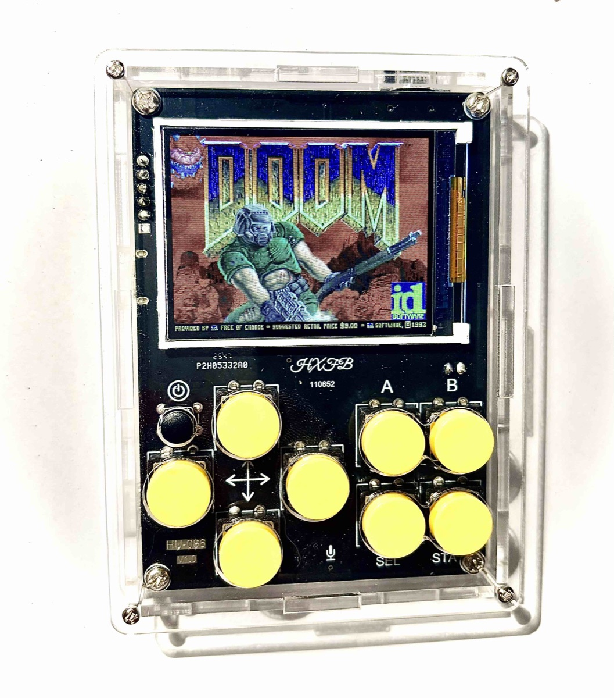
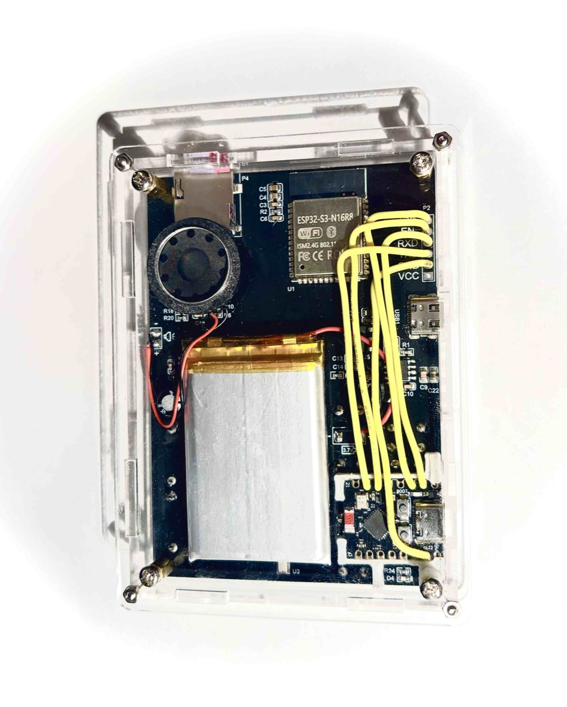

# HXFB HU-086

ESP32-S3 handheld console
[Manufacturer's manual](https://hxfbai.com/newsinfo/8859096.html)

This project uses the HXFB HU-086 handheld DIY kit and adds an ESP32-C3 Super Mini in order to flash a new firmware (retro-go) and get the full potential out of the hardware.



## Getting started

### Assembly

Assemble it following the manufacturer's manual that comes with the kit. One thing to watch
out for here: glue the battery down low enough that there is still room above it for the
speaker.

### Testing

Test the pre-installed games. Does everything work?

### Connecting to a PC/Mac

```
PC/Mac (USB-C) → dongle/hub with USB-A → USB-A-to-USB-C cable → console
```

On the device: **Menu → USB logo → STA**. The drive `NO NAME` then shows up.

**Straight into USB-C does not work.** The board is missing the 5.1 kΩ pull-downs on the
CC lines, so a USB-C host does not detect it at all — no device, no error. USB-A has no CC
negotiation and supplies 5 V unconditionally.

> **Check the cable first.** Many USB-A-to-USB-C cables are charge-only.

This is how additional .nes games can be loaded.


## Flashing new firmware

Not possible through the existing USB port. An ESP32-C3 Super Mini is therefore soldered to
the pin header (IO0, EN, RXD, TXD, GND) and secured with a 3D-printed mount.
Flashing the firmware of the ESP32-S3 is then possible through the ESP32-C3.




| C3 | Console |
|---|---|
| GPIO6 | RXD |
| GPIO20 | TXD |
| GPIO7 | IO0 |
| GPIO10 | EN |
| GND | GND |


1. Flash [`esp32c3_flash_bridge/`](esp32c3_flash_bridge/) onto the C3
   (board *ESP32C3 Dev Module*, *USB CDC On Boot: Enabled*), e.g. with `arduino-cli`:
   ```
   arduino-cli compile -u -p /dev/cu.usbmodemXXXX -b esp32:esp32:esp32c3:CDCOnBoot=cdc esp32c3_flash_bridge
   ```
2. USB cable into the **C3** — the console's own port stays empty
3. Switch the console on and **keep the power button pressed** (see below)
4. `./backup_firmware.sh` — **first**, there is no factory backup
5. `./flash_firmware.sh firmware.bin`
6. Release the power button — the console switches off; switch it on normally

The scripts restart the C3 from the Mac, and on startup the bridge puts the S3 into download
mode via EN and IO0. The C3's RST button therefore does not need to be reachable.

### Power button

In download mode no firmware holds the power latch, so the console switches itself off as
soon as the S3 is reset. Power through the console's USB-C port does not keep it on either.
Keep the power button pressed for the whole run — a weight on it works — or bridge it.

A full backup of the 16 MB flash takes about 5 minutes. The scripts need `esptool` v5 in
PATH. Backups (`backup*.bin`) are git-ignored — keep a copy somewhere safe, the factory
firmware is not available for download.

## retro-go

[retro-go](https://github.com/ducalex/retro-go) (NES, GB, SMS, Mega Drive, MSX, Doom, …) with its own
target in [`retro-go/hu-086/`](retro-go/hu-086/), built with ESP-IDF 4.4.8.

```
git clone https://github.com/ducalex/retro-go.git ../ext/retro-go
git clone -b v4.4.8 --depth 1 --recursive --shallow-submodules \
    https://github.com/espressif/esp-idf.git ~/esp/esp-idf-v4.4.8
~/esp/esp-idf-v4.4.8/install.sh esp32s3

./build_retro_go.sh
./flash_firmware.sh retro-go_*_hu-086.img
```

ROMs go on a FAT32 MicroSD card (`roms/nes/`, `roms/gb/`, …).
Menu: SELECT+START · Option: SELECT+A · Power off: hold the power button for 2 s.

Changes for the HU-086:

- LCD reset pin (GPIO41) switched to GPIO at startup
- Display SPI mode 3 ([patch](retro-go/retro-go.patch))
- Power latch (GPIO1) held across app switches

### Battery level: not possible

The board has no battery sense line, so retro-go shows no battery level (the factory firmware
has none either). A test build logged the free ADC pins to the SD card, each read floating,
with pull-down and with pull-up, on battery and while charging:

| Pin | Reading | |
|---|---|---|
| GPIO3 | 3157 mV, ignores the pulls | tied high (ADC full scale) |
| GPIO4 | ~490 mV, drops with pull-up | driven by something, likely the mic |
| GPIO5 | 0 mV | tied to GND |
| GPIO6 | ~75 mV | likely the LED |
| GPIO12, 13 | 4992 mV, ignores the pulls | tied high (ADC2 out of range) |

A voltage divider from the 3.7 V cell would read a steady 1.5–2.1 V that barely moves with
the pulls. No pin does, and none changed when charging.

## Hardware

- HXFB HU-086 kit (Aliexpress)
- ESP32-C3 Supermini
- 3D-printed mount
- SD card


## More docs

- [Teardown and pinout](https://gijin77.blog.jp/archives/46577853.html)
- [Porting Xiaozhi ESP32](https://gijin77.blog.jp/archives/46637438.html) — GPIO: mic 4/5,
  speaker 7 and 15–17, LCD SPI 38–42, buttons 8/14/46, LED 6
- [esp32_flash_tool](https://gijin77.blog.jp/archives/45426258.html) — backup/restore (Windows)
